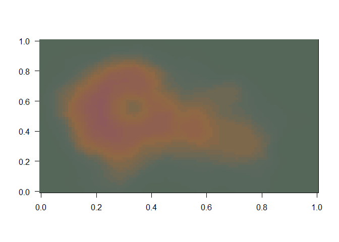

# *spaceMovie* color palette generator


Please cite this package if you use it: 
[](https://zenodo.org/badge/latestdoi/78565513)

The colors used in this package were all found using publically available sources, many of them from LucasArts themselves. For example:

- [Rebels](http://www.starwars.com/news/star-wars-rebels-costume-color-guide-for-padawans-twileks-and-more)
- [Imperials](http://www.starwars.com/news/star-wars-rebels-costume-color-guide-for-imperials)

Other colors gleaned from various sources:

- Colors from Episodes 1-7 were gleaned from [Baptiste](http://www.fubiz.net/en/2015/04/20/the-colors-of-star-wars-palettes/) via [@thonoir](http://www.arcaravaggi.co.uk/)
- Colors for the "Main" list were gleaned from [theforce.net](http://www.theforce.net/fanfilms/postproduction/crawl/opening.asp)

If you would like to contribute to the package, please submit a PR with **documentation for color provenance**.

Kartik Ram's [Wes Anderson](https://github.com/karthik/wesanderson) color palette inspired me to create this package and I followed his implementation for consistency.

### Installation

```r
devtools::install_github("butterflyology/spaceMovie")
```

### Usage

```r
library("spaceMovie")
```

#### Scatterplot with the "Chopper" palette

```r
library("ggplot2")
ggplot(iris, aes(Sepal.Length, Sepal.Width, color = Species)) +
  theme_bw() +
  geom_point(size = 3) +
  scale_color_manual(values = SW_palette("Chopper")) +
  labs(y = "Sepal width", x = "Sepal length") +
  theme(legend.text = element_text(face = "italic"))
```


#### The Empire Strikes Back

```r
SW_palette("TESB")
```


#### "Zeb"

```r
SW_palette("Zeb")
```


#### "Sabine"

```r
SW_palette("Sabine", n = 3)
```


#### "Boba"

```r
SW_palette("Boba", n = 21, type = "continuous")
```


#### Stacked barplot using "Main"

```r
qplot(factor(cyl), data = mtcars, geom = "bar", fill=factor(vs)) +
  scale_fill_manual(values = SW_palette("Main"))
```


#### A Boba Fett volcano!

```r
SW_colors_1 <- SW_palette("Boba", 21, type = "continuous")
image(volcano, col = SW_colors_1, las = 1)
```



#### Heat map

```r
SW_colors_2 <- SW_palette("Hera", 100, type = "continuous")

ggplot(heatmap, aes(x = X2, y = X1, fill = value)) + 
  geom_tile() + 
  scale_fill_gradientn(colours = SW_colors_2) + 
  scale_x_discrete(expand = c(0, 0)) +
  scale_y_discrete(expand = c(0, 0)) + 
  coord_equal() 
```


